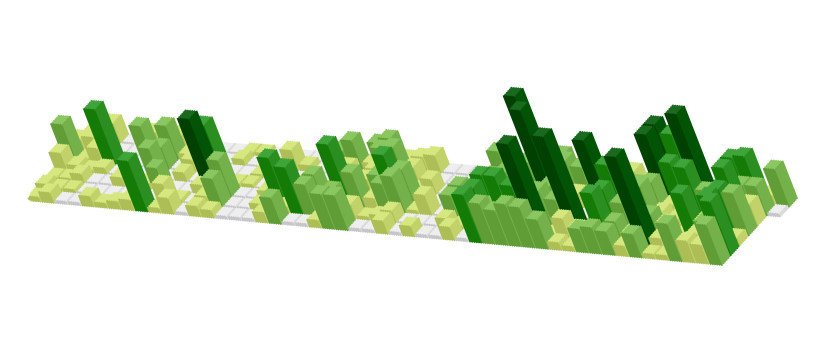
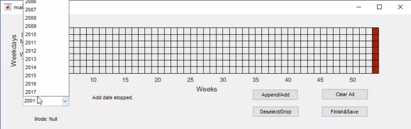

# GitHub canvas - draw the contribution calendar in your own way!

## Description

Draw a timelapse-ish commit diagram in the GitHub green blocks.

Do it the USELESS way!

## Why MATLAB?

Python is way too easy for this task. Why not looking for some trouble?

Only schooling people use MATLAB. Shehuiyener does not use it. Specifically designed for innocent, naive and boring guys in school. What? you in coding career want to make fun of it - hey don't be boring!

Stands as one of the tombstones of my MATLAB years. I've done so many marvelous scripts with it. Just set a few final verdicts for my farse MATLAB decade.

Not in mood of making it a JS online tool. Again, only boring and sloppy guys deserve this.

## Idea

it should be a bash/cmd script generator - git bash on Windows, bash on Linux and Mac.

it should properly handle the permissions, e.g. sudo or Administrator

it should read in from a GUI drawing canvas which has some presets patterns and allows customized ones

it should insert some sleep sentences to avoid too frequent API calls; or it could just generate all the commits and push only once!

it could use some meaningful corpus from Gutenberg corpora to avoid shameful commits.

it could randomly generate some files and delete afterwards to make more FUN!

it could one day load from a image or generated matrix file to make the step easier!

you could make your commit blocks to a serie of drama that tells a consecutive story from year to year!

i guess someone as boring as me might already done this. but I'll do better than them and - more jerkish than those antecedents!

## Versions

### 20180916

- added first version. works fine with mine.

## Usage

0. you'll need a rather newer version of MATLAB, or at least the MATLAB runtime. 
also, find your favorite text file for the commit messages. 
moreover, you need to fork this sub-repo and set up properly the upstream before you can push to GitHub. maybe you would try this repo: https://github.com/zouchtssn/time_lapse_drawing

1. run main.m, use 'add' button to draw directly or 'from file' button to generate the painting from a given image

2. if wrongly added, just use 'drop' button to remove one commit number from the diagram.

3. to start over, select 'clear all' button

4. after finishing your masterpiece, click 'save' to save the shell script as well as the preview image.

5. before running the script, you might need to chmod 777 [YOURSCRIPTFILENAME.sh] to give it proper permissions. also need root permission to run the script. be sure that all the pre-reqs mentioned in the script are met, e.g.: git username, email, filepath and more. if you want to manually push to GitHub later, you need to comment out the git push near EOF.

6. want to wipe the tattoo out? just delete the repo!

## Keywords

easy | tool | childish | GitHub | MATLAB | Commit diagram | canvas everywhere |

## Designs

### init

git config user.name "[your username]"
git confit user.email "[your email addr]"

year to draw  % test to see if the year already occupied and cause overlapping issue / just draw the year before first commit(sign up) so could serve as a leading intro pattern. *NO REVERT WARNING!!*

find out which blocks are eligible to draw on: neglect the borders and try to draw on the center

### date

in Linux and macOSX, sudo date 062614102014.30 = MMDDhhmmYY.ss

in Windows, date need special permissions, might compile a program to binaray executable to deal with it? Windows does not have sudo

实际上最好是用js写，直接可以用GitHub的svg表格，自己再添上类似于button等记录点击的控件即可。

### anticipated steps

fork first

初始化名字和邮箱
初始化开始绘制日期 - 不能为当前年份
遍历图形矩阵，点多次预览颜色更深，数组直接往后添即可
	根据坐标切换日期，随机根据语料库append文件，git add 该文件然后commit信息生成
git push
输入账号密码

结束

### bug of GitHub

- we are losing 2000/01/01 block.

Due to the extended 54-week corner case of a 366-day leap year 2000, the 53*7 canvas cannot hold its width. Therefore, Jan 1st 2000 is a good date to hide your **MOST SECRET COMMITS YEEAW!!**

- Sunday mode 
如何处理不同国家第一行为周日或周一的问题'

- shell写文件append字符串 echo "aaa" >> /home/kevingo/example.txt  
https://www.cnblogs.com/taosim/articles/3761007.html

- draw from image
长图转化为灰度图再转化为四阶绿图的程序51*7分辨率

- dimensions
每年共有53列，最左侧一列中包含1月1日，除2000年外。
定位框可以是第二列到第52列，即每年第一个周日和倒数第二个周日

- output figure
保存画好的plot以供对比

- variables to set
地址行可以自行设定

## More to add

- 系统类型

- auto sudo

- 保存commit历史以便覆盖

## 过程记录

如果希望控件位置自适应，需要 Options -> GUI Options -> Porpotional

- 缘尽MATLAB
现在的MATLAB和我刚开始用的时候已经有了不少的区别了。有些地方更智能，有些地方则变得繁琐。无论如何，假如我将走上平凡之路，则应道一声珍重，就此别过。

> 去年今日此门中，人面桃花相映红。 人面不知何处去，桃花依旧笑春风。

- savefigure巨大的挫折
MATLAB的强项做图居然也会有这么不理想的设计……无法从GUI中优雅地直接存储图像。

- Mac换行符

[Unix/Linux/Mac 与 Windows 的换行符不统一的原因/目的是什么？ - hhhhhhhhh的回答 - 知乎](https://www.zhihu.com/question/46542168/answer/101979873)

> 至于为什么 mac 可以改，因为 mac os x 和 mac os 简直就是超越了雷锋和雷峰塔的区别。。。
不得不说，比起 mac os x， mac os 和蟑螂长得更像一些。。。

banner source: https://bbs.byr.cn/#!design/2

extremely bad at dealing with images with gradient background.

## Similar repos

https://github.com/gelstudios/gitfiti

https://github.com/public-contributions/HACK

https://github.com/jasonlong/isometric-contributions

http://pokrovsky.herokuapp.com/

https://github.com/pikesley/pokrovsky

https://github.com/bayandin/github-board

https://codepen.io/sebdeckers/pen/vOXeKV

https://github.com/ben174/git-draw

well... it seems that there are more dull programmers in the world than I've imagined...(even many years ago) that's why i do not want to career towards a 'coder'...
