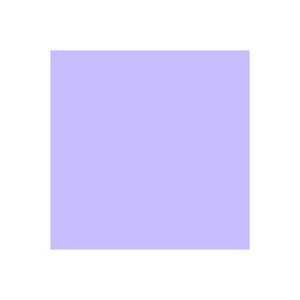
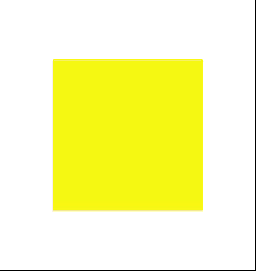

## Description

一个练手的绘图程序。

源自看到的[一则秀恩爱博文](http://localhost-8080.com/2014/11/mathematica-wolframalpha-logo-origami/)。

看到博主大姐提到的“不到一分钟”就画出了那张图，感觉备受打击。花了15秒思考了一下MATLAB里应该怎么画图，发现剩下的时间根本不够写出这个程序。大概有半年多没有碰MATLAB了，索性趁此机会找找感觉。

大概花了15分钟写了这个程序，过程可谓历经坎坷~~记性差到百度“MATLAB for循环”的地步~~

配合Animoji to GIF的项目也画出了自己的版本，只是没有原图好看。用的是parula的内置色板。或许mathematica的色板更美观吧。

## Versions

### 20180811

- mine first.

## Usage

run it. set all the variables at your wish.

## Keywords

easy | tool | MATLAB | square | Origami | Tengami | matrix67

## Result

其余请参见repo内视频
